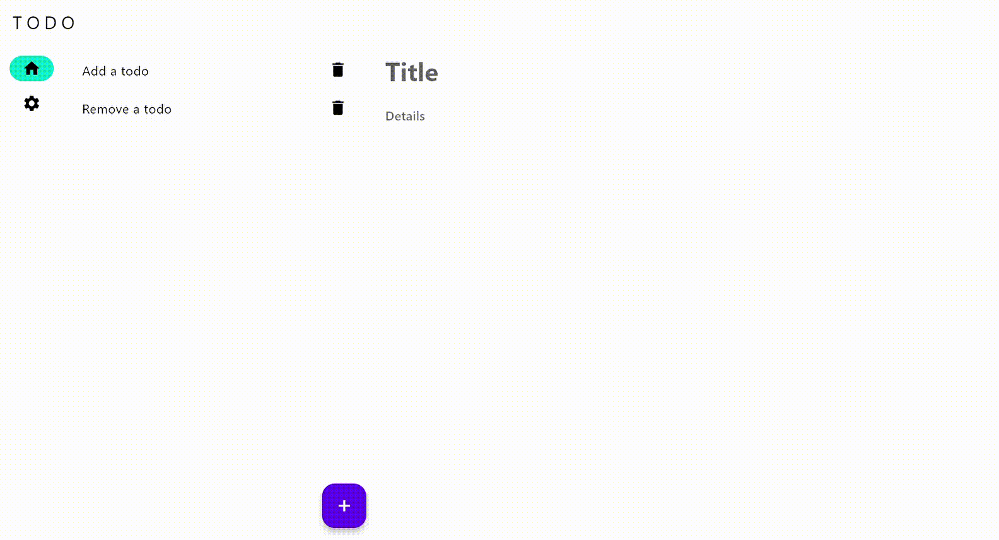

# TODO

Flutterを使用して開発した、TODOアプリ。

今回のアプリ開発は、「多画面対応」を意識して行いました。

## スクリーンショット

## 動画

下記のZIPを展開すると実行ファイル（exe）があります。（Windows x64向け）
> zip\windows.zip

アプリを実行すると、アプリデータの保存のために、下記のDBファイルが作成されます。
> C:\Users\ ___[user-name]___ \Documents\databases\todo.db
